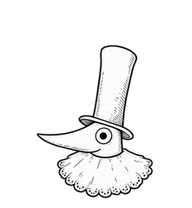

# 长嘴礼帽先生 · 最终侧面版

黑白墨线、白色不透明填充，长而尖的嘴、高礼帽与褶皱围领。所有朝向都保持侧面，不出现正脸。头、嘴和帽子保持紧凑关系，帽檐与嘴之间是真实透明的外部间隙。

- [最终透明图集](spritesheet.png)
- [九种动作视频](previews/all-states.mp4)
- [十六方向视频](previews/look-loop.mp4)
- [设计原图](source/canonical-design.png)
- [注册后行源图](source/registered-rows/)
- [布局、预览时长与校验值](manifest.json)
- [验证摘要](validation.json)

图集为 1536 × 2288、每格 192 × 208，九种动作和十六方向；完整行序与接入方法见[公共说明](../README.md)。最终图集哈希：

`25f1ef9f6cb10fd0b9df02bfc880ce9dbbad8514770b7b3425b490336feb4837`

## 来源与版本

本包是完成紧凑头帽修订和围领注册修正后的最终侧面版。前九行 57 个已批准动作帧保持不变；最后两行是修订后的十六方向。图像素材经生成、透明化与统一注册后整理为运行时图集。行源图从最终图集无损拆出，设计原图仅作造型参考；没有额外的程序化角色模型。

## 方向规则与已接受限制

十六方向表达视线和抬头/低头，不是三维转台。为始终避免正脸，180°→202.5°、337.5°→0°采用明确的二维左右侧面切换；这是保留的设计选择，不应通过插入正脸修补。

围领位置已统一，先前 157.5°→180°的明显帽子弹跳已修复。部分斜向抬头变化较克制，个别相邻方向的像素差与中心偏移仍高于邻帧；质量检查以已审阅警告记录，未宣称整个方向圈完全连续。完整摘要见 `validation.json`。
